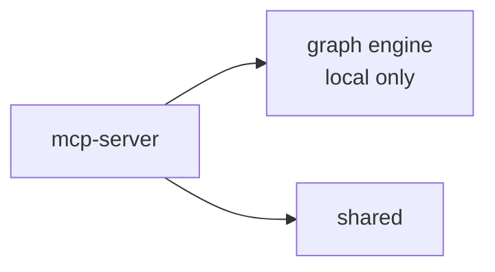
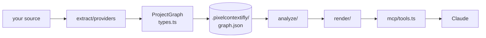
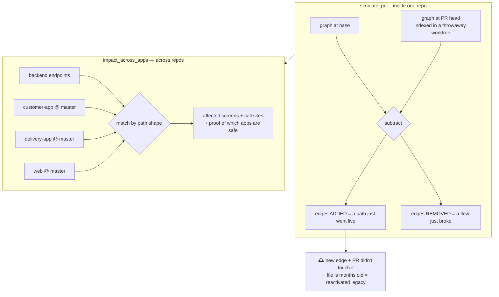

# CODE_ARC — the developer's map of this codebase

> **ARCHITECTURE.md** says *why* the system is shaped this way and what the rules are.
> **This file** says *where the code is* and *what happens when*. Read this one first
> if you're about to change something.
> **SKILLS.md** covers the four bundled skills — how they work and how to add one.

---

## 1. What this repo actually is

One product — **the memory** — built around one idea:

| | **The memory** |
|---|---|
| Question | "how does this codebase fit together?" |
| Input | your source code |
| Work | static parsing → a graph |
| Output | deterministic answers about structure |
| Runs | 100% locally (no network at all) |
| Lives in | `packages/mcp-server/src/graph/` |

**Everything reaches the user through the MCP server.** It's the front door: Claude
Code (and any MCP client) talks to it over stdio, and the same binary doubles as a CLI.

---

## 2. Package map

```
packages/
├── mcp-server/     ← the product. MCP tools + CLI + the whole graph engine
│   ├── src/index.ts          stdio entry point (or hands off to the CLI)
│   ├── src/cli.ts            `contextifly map|analyze|impact|search|savings|feature|diff`
│   ├── src/server.ts         registers the tools; delegates to graph/mcp/tools.ts
│   ├── src/graph/            the graph engine — see its own README.md
│   └── skills/               4 bundled skills the AI loads (copilot, refactor, rosetta, whatif)
│
├── shared/         ← shared TypeScript types (MCP_TOOL_NAMES)
└── render/         ← R&D spike, not wired to the product (see §10)
```

Dependency direction, and it only goes one way:



The graph engine depends on **nothing** — not the network, not an LLM. That's
deliberate: it's what makes every structural answer reproducible.

---

## 3. Flow A — code becomes answers



`packages/mcp-server/src/graph/README.md` documents every folder. The short version:

| Folder | Job | Rule |
|---|---|---|
| `extract/` | parse source → nodes + edges | providers never import each other |
| `store/` | persist the graph; know where git is | the only filesystem/git access |
| `analyze/` | questions over the graph | pure: in a graph, out data — never renders |
| `render/` | data → markdown / mermaid / html | never traverses, never touches git |
| `mcp/` | expose it as tools | the only outward-facing surface |

A layer may only import from the ones above it. That single rule is why you can
answer "where does this go?" without asking anyone.

**Freshness is automatic.** `loadIndex()` (bottom of `mcp/tools.ts`) re-indexes when git
moved or a file changed, so no tool can answer from a stale graph. Re-indexing is
incremental — only dirty files and their importers get re-parsed.

**Cross-provider linking happens through node ids, not code.** A web `fetch('/orders')`
and a NestJS `@Get('/orders')` both produce the id `api:GET /orders`, so they connect
without either parser knowing the other exists. That id scheme is also what makes §4 possible.

## 4. Flow B — pre-merge blast radius

The newest piece, and the one that needs the most explaining because it works
differently from everything else: **it builds more than one graph.**



- `analyze/pr-simulation.ts` — the two-graph diff and the four analyzers
- `analyze/fleet.ts` — indexes each consumer app at **its master branch**, cached by sha
- `analyze/endpoints.ts` — how `/orders/:id`, `/orders/$id` and `/orders/${id}` become
  the same endpoint, with a confidence when the match isn't exact
- `store/git.ts` → `withWorktree()` — checks a ref out into a temp dir so we can index
  another commit without touching your working tree. Both flows above depend on it.

Configured by `contextifly.workspace.json` in the backend repo (the tool scaffolds one).

## 5. The IR — the one contract everything agrees on

`graph/types.ts` (161 lines) is the whole data model. Read it before anything else.
Providers write it, analyzers read it, nothing else crosses the boundary.

**12 node types**, syntax-level, emitted by providers:

| Group | Types |
|---|---|
| frontend | `file` · `component` · `route` · `api` · `hook` · `context` |
| backend | `controller` · `service` · `module` · `entity` |
| native bridge | `channel` (a named Flutter platform channel) · `native` (the Kotlin/Java/Swift file handling it) |

**6 semantic roles**, framework-agnostic, assigned by the normalizer — never by a
provider. An analyzer that wants *meaning* reads `role`; one that needs syntax precision
reads `type`. Both always coexist; the role never replaces the type.

`route`/`controller` → `entry-point` · `api` → `http-boundary` · `service` →
`business-logic` · `module` → `composition-root` · `entity` → `data-model` ·
`context` → `state`. Anything not derivable with certainty is left unset rather than
guessed — a wrong role misleads every downstream consumer.

**11 edge kinds**, each with a fixed direction:

| Kind | From → To |
|---|---|
| `imports` | file → file, module → module |
| `defines` | file → component / hook / context / controller / service / module / entity / api |
| `renders` | component → component |
| `routes_to` | route → component, api → controller (a thing resolves to its handler) |
| `navigates_to` | component / file → route |
| `uses` | component / hook / file / service → hook / context / entity |
| `calls` | component / file → api |
| `injects` | controller / service / module → service (constructor DI) |
| `contains` | module → controller / service |
| `invokes` | component / file → channel (Dart side calls a platform channel) |
| `handles` | native → channel (native code implements one) |

**Node ids are the load-bearing detail.** They are deterministic and content-free:

```
file       relPath                    src/checkout/CartPage.tsx
symbol     relPath#Name               src/checkout/CartPage.tsx#CartPage
route      route:/path                route:/cart
api        api:METHOD /path           api:POST /orders
```

That last one is why cross-provider linking needs no code: the frontend provider seeing
`fetch('/orders')` and the NestJS provider seeing `@Post()` both emit `api:POST /orders`,
so they land on the same node without either parser knowing the other exists. It is also
what §4 joins repos on.

**Every AST-derived edge carries provenance** (`source: { file, line }`). `confidence` is
omitted for deterministic facts (meaning 1.0) and set below 1.0 *only* alongside a
human-readable `reason` — heuristic matches are never allowed to look like facts.

**Versioning is deletion, not migration.** `ProjectGraph.version` is `2`; `loadGraph()`
returns `null` for anything else and the caller re-indexes. The graph is derived data, so
a schema change costs one rebuild and zero migration code.

## 6. The extraction layer — four providers, one sink

A provider compiles one slice of the project into IR. The contract
(`extract/providers/provider.ts`) is three lines wide:

```ts
extract(root, prev, opts): ProviderOutput | null   // null = nothing here for me
```

| Provider | Lines | Emits |
|---|---|---|
| `frontend.ts` | 675 | React/Next.js: components, routes (app + pages router), hooks, contexts, `fetch`/`axios` calls. The only provider with incremental support |
| `nestjs.ts` | 276 | Controllers, services, modules, entities (TypeORM + sequelize-typescript), routes with global-prefix resolution, constructor DI. The smallest complete provider — read this one first |
| `dart.ts` | 355 | Flutter: widgets, GoRouter + named routes, `http`/`dio`, Riverpod/Provider/Bloc, `MethodChannel`/`EventChannel` |
| `native.ts` | 119 | Kotlin/Java/Swift/Obj-C channel handlers, linked to `dart.ts`'s channels by channel name |

`extract/indexer.ts` orchestrates them in that fixed order and does five things after:

1. **Merge through `GraphSink`.** Nodes dedup by id, and when two producers emit the same
   id the *richer* one wins — a node backed by a declaration (`declared`, or an owning
   `file`) beats a synthesized reference regardless of which provider ran first. Edges
   dedup on `from|kind|to`.
2. **Repair pass.** Carried-over incremental edges can reference `route:`/`api:` nodes
   whose owning file wasn't re-parsed; they're recreated deterministically from the id.
3. **Normalize** — assign semantic roles.
4. **Sort** nodes by id and edges by `from|kind|to`, so an incremental rebuild is
   byte-identical to a full one. This is what makes the ~17ms no-op verifiable.
5. **Stamp** git HEAD, provider list, per-file sha1 hashes, and `IndexStats`.

File discovery (`discoverFiles`) hashes as it walks, skips hidden dirs and
`node_modules`/`dist`/`build`/`out`/`coverage`, and never parses — so staleness checks
cost a read, not a compile.

## 7. Tool catalogue — all 15

Every tool is registered in `graph/mcp/tools.ts` through the same wrapper, which does
three things before you ever see a handler:

- **`assertKnownTool(name)`** — a tool missing from `src/tool-manifest.ts` throws at
  startup. The manifest carries the trust class that `contextifly permissions` generates
  its allowlist from, so a tool added without one would silently go un-allowlisted and
  users would get surprise prompts on upgrade. It fails loudly in development instead.
- **`loadIndex(projectDir)`** — auto-refresh (§3). Every answer is hash- and git-checked
  first; a stale graph is re-indexed transparently and the answer is prefixed with
  `♻️ …graph auto-refreshed`.
- **`recordUsage(...)`** — appends to the local ledger on success only. Best-effort:
  bookkeeping never breaks an answer.

`src/tool-manifest.ts` is the registry of record for trust classes; the tools below are
the ones this map covers. All are `local` — repo in, `.pixelcontextifly/` out.

### Build and inspect

| Tool | Params | Chain |
|---|---|---|
| `index_project` | `projectDir` | `extract/indexer.ts:indexProject` → `store/graph-store.ts:saveGraph` → `render/graph-html.ts:saveGraphHtml` → `store/git.ts:saveGitState` |

The fast path matters: if `graphIsFresh()` (git branch + HEAD + main-head unmoved, zero
changed file hashes) it returns `renderReuse()` — **no rebuild and no file write at all.**
Otherwise it reports per-type counts plus `reparsed`/`reused` when the run was incremental.

| Tool | Params | Chain |
|---|---|---|
| `get_project_map` | `projectDir` | `render/project-map.ts:renderProjectMap` — every route with its `routeSubtree` component tree and `calls` edges, plus a Mermaid navigation diagram |
| `search_graph` | `projectDir`, `query` | `analyze/search.ts:searchNodes` — scores exact 100 / name-prefix 80 / name-substring 60 / id-substring 40, top 20, each with up to 6 in- and out-relations |

### Impact and simulation

| Tool | Params | Chain |
|---|---|---|
| `get_impact` | `projectDir`, `target` | no separate analyzer — the handler in `tools.ts` composes `index.resolve` → `index.dependents` directly |

Worth knowing because the thresholds are policy, not math: it takes the **top 3** resolved
matches, and per match collects the blast radius by walking `calls` (APIs), `uses` →
`context` (state) and `invokes` (native channels) over every affected id. Risk is
**High** at ≥3 affected routes or ≥20 dependents, **Medium** at ≥1 route or ≥6, else
**Low**. Dependent lists are capped at 40 with an "…and N more" tail.

| Tool | Params | Chain |
|---|---|---|
| `what_if` | `projectDir`, `action` (`remove` \| `split` \| `lazy_load`), `target` | `analyze/what-if.ts:whatIf` |

Resolves to the single best match and simulates: `remove` (what breaks immediately, what's
at risk transitively, which routes stay safe — `defines`/`imports` in-edges are excluded
as mechanical, not breakage), `split` (call sites to update, natural boundaries from
child/state clusters), `lazy_load` (exclusive vs shared subtree, loading boundaries).

| Tool | Params | Chain |
|---|---|---|
| `simulate_pr` | `projectDir`, `ref?`, `base?`, `patch?` | `analyze/pr-simulation.ts:simulatePr` |

The only tool that builds **more than one graph**. `base` resolves `master` then `main`.
`graphAt()` short-circuits when the stored graph's `commit` already equals the target sha;
otherwise `store/git.ts:withWorktree()` checks the ref into a temp dir and indexes it with
`force: true`. A `.diff`/`.patch` is applied on top of base the same way. Then it subtracts
edge sets and runs the four analyzers, each computing *behaviour that moved, minus
everything the PR touched* — plus a fifth section that delegates across repos:

1. `userSurface` — routes/screens reachable from the change
2. `reactivatedLegacy` — a new edge into untouched code whose last commit is older than
   **180 days** (`LEGACY_DAYS`), bounded to **40** `git log` probes so it can't become a
   repo scan. This is the incident the tool exists for
3. `contractRisks` — changed `api`/`service`/`controller`/`entity`/`hook`/`context`/
   `channel` nodes that untouched consumers still call, with `firstUnguardedChain()`
   sniffing **12 lines** past each call site for an unguarded dereference
4. `brokenFlows` — callers left pointing at something removed
5. `renderCrossApp` — delegates to fleet analysis (below)

Output is capped at 12 rows per section and ends with a `verdict(blockers, risks)` and a
ranked test scope. Your checkout is never touched.

| Tool | Params | Chain |
|---|---|---|
| `impact_across_apps` | `projectDir`, `target` | `analyze/fleet.ts:renderImpactAcrossApps` |

Needs `contextifly.workspace.json` (scaffolded on first run). Joins repos through
`analyze/endpoints.ts` — see §4 for why the endpoint is the only shared symbol. Each app
is indexed at **two** roles: `release` (master → main, from a detached worktree) and
`checkout` (the branch that repo has open, working tree included) when they differ. Graphs
cache under `.pixelcontextifly/fleet/` keyed by sha; **a dirty working tree is never
cached**, because a sha no longer describes what's in it. Up to 6 call sites per endpoint.

The endpoint join itself is the one place confidence is not 1.0: identical shape → 1.0;
same depth with a parameter meeting a literal → 0.8; a segment-aligned suffix (the classic
un-set `basePath`) → 0.6, always with the reason attached.

### Explain

| Tool | Params | Chain |
|---|---|---|
| `trace_flow` | `projectDir`, `from`, `to?` | `render/visual.ts:traceFlow` — with `to`, shortest path over navigation/render/API edges decorated with branches; without, the forward journey tree |
| `explain_visually` | `projectDir`, `target` | `render/visual.ts:renderExplainVisually` — navigation-in, render tree, data flow, and a state-placement decision tree with this project's branch highlighted. Bounded at 22 nodes per diagram, depth 3 |
| `get_feature` | `projectDir`, `feature?` | `analyze/features.ts` — `loadFeatureConfig` (`contextifly.features.json` or `.pixelcontextifly/features.json`) else `deriveFeatures` from top-level route segments; then `renderFeatureList` or `renderFeature` |
| `match_screenshot` | `projectDir`, `element?` \| `markdown?` | `analyze/search.ts:matchUiElement` — text in, no upload. Whole phrase weighted ×2, then per-token ≥3 chars ×1, scores summed, threshold 60, top 5, each with the routes whose render tree contains it |

### Health and time

| Tool | Params | Chain |
|---|---|---|
| `analyze_project` | `projectDir` | `analyze/health.ts:analyzeProject` — score 0–100: circular imports, dead code (Next.js framework entry points like `page`/`layout`/`middleware` are exempt, since the framework invokes them and no import edge exists), unused endpoints, oversized components, duplicate names, JSX-shape structural duplicates |
| `graph_diff` | `projectDir`, `snapshot?` | `store/graph-store.ts:listSnapshots`/`loadSnapshot` → `render/history.ts:renderGraphDiff`. Defaults to the newest snapshot |
| `graph_timeline` | `projectDir` | every snapshot oldest-first plus current → `render/history.ts:renderTimeline` |

Snapshots are a side effect of `saveGraph`: the previous graph is archived only when its
`contentKey` (files + nodes + edges, **ignoring `indexedAt`**) differs, so no-op re-indexes
never pile up history. Last 20 kept.

### Meta

| Tool | Params | Chain |
|---|---|---|
| `token_savings` | `projectDir` | `store/usage-ledger.ts:renderSavingsReport` + `render/savings-html.ts:saveSavingsHtml` |

**Registered directly, not through the wrapper** — that's deliberate, so the report never
counts itself. Its primary claim is *work avoided* (files not read); only answer sizes,
latency, and compression are measured, and every derived figure is badged estimated.

## 8. Skill catalogue — all 4

Skills are **instructions, not code**: markdown under `packages/mcp-server/skills/<name>/`,
loaded by the AI, telling it which tool to reach for, in what order, and what it may claim
about the result. They ship with the plugin and need no setup. Full treatment, including
how to add one: [SKILLS.md](SKILLS.md).

| Skill | Triggers on | Tool sequence |
|---|---|---|
| `codegraph-copilot` | "explain this project", onboarding docs, "find the payment flow", complexity estimates, ticket breakdown, root-cause | `index_project` → `get_project_map` first, always. Then per playbook: `trace_flow` for flows, `analyze_project` + high-degree `search_graph` for onboarding, `get_impact` for estimates, and graph **plus** git (`graph_timeline`/`graph_diff` → `git log -S`) for root cause |
| `codegraph-refactor` | "what should I refactor", split/merge/dedupe, dead code, bundle size | `index_project` → `analyze_project` + `get_project_map` for evidence → `get_impact` on **every** candidate before recommending it → read the top 3–5 files. Never applies changes; max 6 suggestions ranked by value-to-risk |
| `codegraph-whatif` | "is this PR safe?", "who breaks if I change this service?", "what do I regression-test?" | `simulate_pr` for a branch/patch, `impact_across_apps` for a service without a PR, `what_if` for one node, `get_impact` when no verdict is needed |
| `codegraph-rosetta` | "explain this like I'm a NestJS dev", landing in Django / Spring Boot / FastAPI / Flask / Go / Rust | Detects the target framework from marker files (`manage.py`, `pom.xml` + `@SpringBootApplication`, `go.mod`, `Cargo.toml`…), never asks. Translates concepts against `references/<framework>.md`, anchored to real files from the graph |

Two rules run through all of them, and they're the reason the skills exist at all:

- **Query the graph first, read code second.** The graph gives the verified skeleton;
  source files are only for behaviour the graph can't see — validation rules, retry logic,
  error dialogs — and only the files the tool output already named.
- **Never launder a confidence score.** Cross-repo matches below 100% and the
  unguarded-dereference sniff are heuristic. The caveat is passed through, once, not
  hedged on every line. `codegraph-whatif` additionally requires reporting the *unaffected*
  apps — reachability is a closed set, so "delivery-app is fine" is a proof, not a
  guess — and escalating mobile breaks, because shipped builds can't be hotfixed.

## 9. Where state lives

| What | Where | Notes |
|---|---|---|
| The graph | `<project>/.pixelcontextifly/graph.json` | derived data, self-ignoring, never committed |
| Snapshots | `.pixelcontextifly/history/*.json` | last 20; powers `graph_diff` / `graph_timeline` |
| Git position | `.pixelcontextifly/git-state.json` | staleness check without re-parsing anything |
| Consumer app graphs | `.pixelcontextifly/fleet/<app>.json` | keyed by that app's master sha |
| Usage ledger | written by `store/usage-ledger.ts` | powers `token_savings` |

Everything in `.pixelcontextifly/` is disposable: delete it and the next `index_project`
rebuilds it.

## 10. `packages/render` — read this before you touch it

An R&D spike: compiling declarative UI into a measurable execution model
(React IR → Runtime IR → Execution Plan → Scene Frames), validated against React itself.
Plain `.cjs` scripts, run by hand, **not imported by any shipped package**, and its npm
scripts point at a hard-coded path on one developer's machine. Treat it as a lab
notebook, not as part of the product — and don't wire it in without deciding it graduated.

## 11. Reading order for a new developer

1. `packages/mcp-server/src/graph/types.ts` — 160 lines. The whole data model. Nothing
   else makes sense before this.
2. `packages/mcp-server/src/graph/README.md` — the engine's own map.
3. `packages/mcp-server/src/graph/analyze/graph-index.ts` — the three traversals every
   feature is built from: `resolve`, `routeSubtree`, `dependents`.
4. `packages/mcp-server/src/graph/mcp/tools.ts` — read **one** tool handler end to end.
   They're all the same shape: load index → call analyzer → render → return.
5. `packages/mcp-server/src/graph/extract/providers/nestjs.ts` — the smallest complete
   provider (276 lines). Now you know how source becomes graph.
6. `ARCHITECTURE.md` — the rules, now that you can see what they're protecting.

## 12. Where does my change go?

| I want to… | Put it in |
|---|---|
| support a new framework | `graph/extract/providers/<name>.ts` — nothing else changes |
| answer a new question about the code | `graph/analyze/`, as a pure function taking `GraphIndex` |
| show an existing answer differently | `graph/render/` |
| give the AI a new tool | `graph/mcp/tools.ts` — wire an analyzer to a renderer |
| read git or the filesystem | `graph/store/`, then call it from `analyze/` |
| add a shared type | `packages/shared/src/index.ts` |
| teach the AI a workflow, not a capability | `packages/mcp-server/skills/<name>/SKILL.md` — see [SKILLS.md](SKILLS.md) |

If your change doesn't fit any row, that's a signal worth taking seriously — see the
governance section of `ARCHITECTURE.md` before building it.

## 13. Verifying a change

```bash
pnpm build                       # typecheck + emit, whole workspace
pnpm --filter @contextifly/mcp-server test   # graph self-checks
```

The self-check covers the two genuinely heuristic pieces (cross-repo endpoint matching
and the unguarded-dereference sniff). Everything else in the engine is deterministic
traversal — if it breaks, the typechecker or a tool answer will say so loudly.
