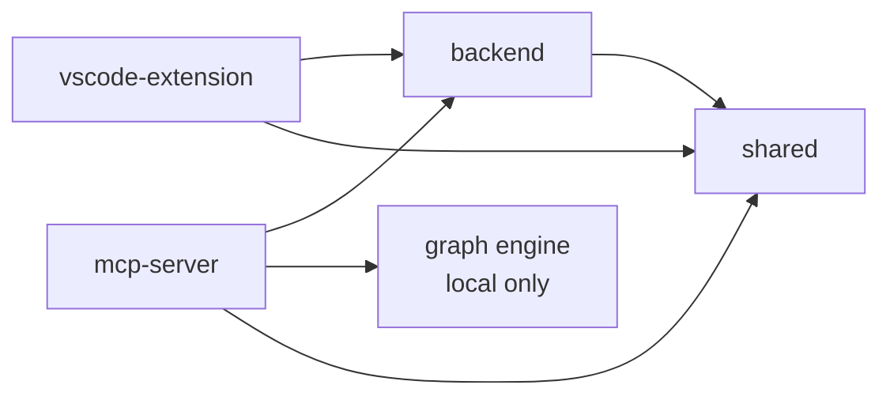
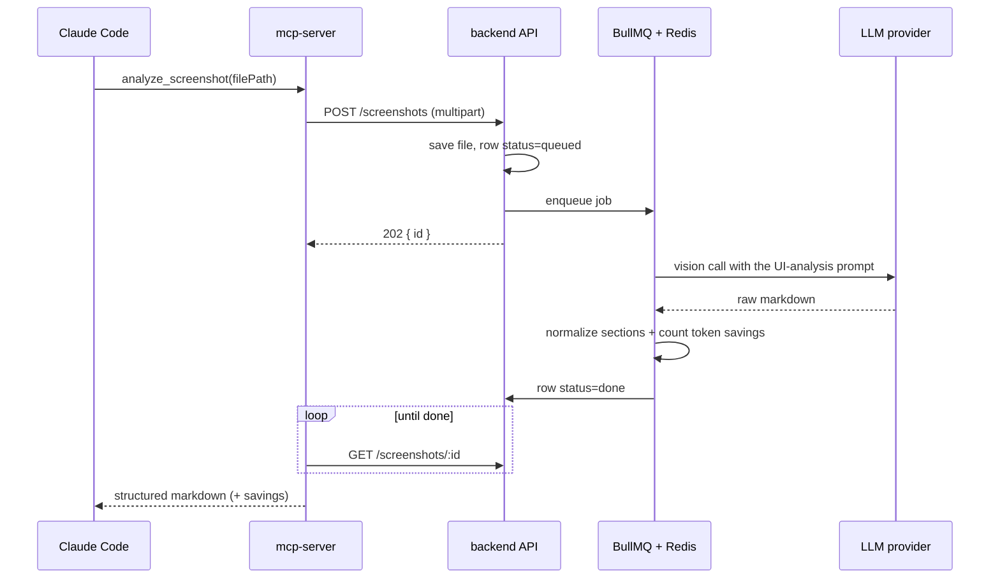
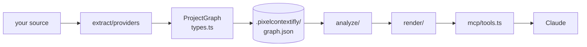
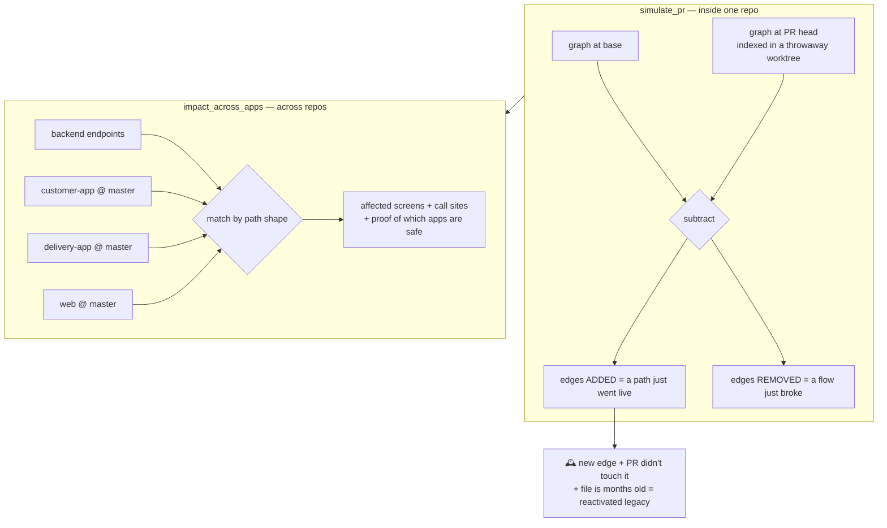

# CODE_ARC — the developer's map of this codebase

> **ARCHITECTURE.md** says *why* the system is shaped this way and what the rules are.
> **This file** says *where the code is* and *what happens when*. Read this one first
> if you're about to change something.
> **SKILLS.md** covers the four bundled skills — how they work and how to add one.

---

## 1. What this repo actually is

Two products that share one monorepo, one type package, and one idea:

| | **The eye** | **The memory** |
|---|---|---|
| Question | "what is on this screen?" | "how does this codebase fit together?" |
| Input | a screenshot (PNG/JPEG/WebP) | your source code |
| Work | LLM vision → structured markdown | static parsing → a graph |
| Output | ~95% fewer vision tokens | deterministic answers about structure |
| Runs | on a server (needs an LLM key) | 100% locally (no network at all) |
| Lives in | `packages/backend` + `packages/mcp-server/src/server.ts` | `packages/mcp-server/src/graph/` |

They meet in one place: `blueprint_screenshot`, which takes the eye's output and maps
every element it saw onto the memory's nodes — screenshot → the code that renders it.

**Everything reaches the user through the MCP server.** It's the front door: Claude
Code (and any MCP client) talks to it over stdio, and the same binary doubles as a CLI.

---

## 2. Package map

```
packages/
├── mcp-server/     ← the product. MCP tools + CLI + the whole graph engine
│   ├── src/index.ts          stdio entry point (or hands off to the CLI)
│   ├── src/cli.ts            `contextifly map|analyze|impact|search|savings|feature|diff`
│   ├── src/server.ts         the 2 screenshot tools; delegates the rest to graph/mcp/tools.ts
│   ├── src/backend-client.ts the only file that makes network calls
│   ├── src/graph/            the graph engine — see its own README.md
│   └── skills/               4 bundled skills the AI loads (copilot, refactor, rosetta, whatif)
│
├── backend/        ← NestJS API: upload a screenshot, get markdown back
├── shared/         ← types both sides import (ScreenshotRecord, LlmOverride, MCP_TOOL_NAMES)
├── vscode-extension/  ← paste or drop an image into VS Code, get markdown inline
└── render/         ← R&D spike, not wired to the product (see §7)
```

Dependency direction, and it only goes one way:



The graph engine depends on **nothing** — not the backend, not the network, not an
LLM. That's deliberate: it's what makes every structural answer reproducible.

---

## 3. Flow A — a screenshot becomes markdown



Read it in this order:

1. `packages/mcp-server/src/server.ts` — the tool, and the polling loop
2. `packages/backend/src/screenshots/screenshots.controller.ts` — `@Post()` / `@Get(':id')`
3. `packages/backend/src/queue/screenshot.processor.ts` — **the actual work happens here**
4. `packages/backend/src/llm/providers/` — gemini / openai / anthropic behind one interface
5. `packages/backend/src/markdown/markdown.service.ts` — normalizes the LLM's output and
   reports which sections came back missing

Two things worth knowing:

- The upload responds **202 immediately**; the MCP tool polls. Nothing blocks a worker.
- A caller can bring their own LLM key per request (`LLM_OVERRIDE_HEADERS` in `shared`),
  so the server's key is a default, not a requirement.

## 4. Flow B — code becomes answers



`packages/mcp-server/src/graph/README.md` documents every folder. The short version:

| Folder | Job | Rule |
|---|---|---|
| `extract/` | parse source → nodes + edges | providers never import each other |
| `store/` | persist the graph; know where git is | the only filesystem/git access |
| `analyze/` | questions over the graph | pure: in a graph, out data — never renders |
| `render/` | data → markdown / mermaid / html | never traverses, never touches git |
| `mcp/` | expose it as tools | the only outward-facing surface |

A layer may only import from the ones above it. That single rule is why you can
answer "where does this go?" without asking anyone.

**Freshness is automatic.** `loadIndex()` (bottom of `mcp/tools.ts`) re-indexes when git
moved or a file changed, so no tool can answer from a stale graph. Re-indexing is
incremental — only dirty files and their importers get re-parsed.

**Cross-provider linking happens through node ids, not code.** A web `fetch('/orders')`
and a NestJS `@Get('/orders')` both produce the id `api:GET /orders`, so they connect
without either parser knowing the other exists. That id scheme is also what makes §5 possible.

## 5. Flow C — pre-merge blast radius

The newest piece, and the one that needs the most explaining because it works
differently from everything else: **it builds more than one graph.**



- `analyze/pr-simulation.ts` — the two-graph diff and the four analyzers
- `analyze/fleet.ts` — indexes each consumer app at **its master branch**, cached by sha
- `analyze/endpoints.ts` — how `/orders/:id`, `/orders/$id` and `/orders/${id}` become
  the same endpoint, with a confidence when the match isn't exact
- `store/git.ts` → `withWorktree()` — checks a ref out into a temp dir so we can index
  another commit without touching your working tree. Both flows above depend on it.

Configured by `contextifly.workspace.json` in the backend repo (the tool scaffolds one).

## 6. Where state lives

| What | Where | Notes |
|---|---|---|
| The graph | `<project>/.pixelcontextifly/graph.json` | derived data, self-ignoring, never committed |
| Snapshots | `.pixelcontextifly/history/*.json` | last 20; powers `graph_diff` / `graph_timeline` |
| Git position | `.pixelcontextifly/git-state.json` | staleness check without re-parsing anything |
| Consumer app graphs | `.pixelcontextifly/fleet/<app>.json` | keyed by that app's master sha |
| Usage ledger | written by `store/usage-ledger.ts` | powers `token_savings` |
| Screenshots + results | Postgres (sequelize) + upload dir | backend only |
| Job queue | Redis (BullMQ) | backend only |

Everything in `.pixelcontextifly/` is disposable: delete it and the next `index_project`
rebuilds it.

## 7. `packages/render` — read this before you touch it

An R&D spike: compiling declarative UI into a measurable execution model
(React IR → Runtime IR → Execution Plan → Scene Frames), validated against React itself.
Plain `.cjs` scripts, run by hand, **not imported by any shipped package**, and its npm
scripts point at a hard-coded path on one developer's machine. Treat it as a lab
notebook, not as part of the product — and don't wire it in without deciding it graduated.

## 8. Reading order for a new developer

1. `packages/mcp-server/src/graph/types.ts` — 160 lines. The whole data model. Nothing
   else makes sense before this.
2. `packages/mcp-server/src/graph/README.md` — the engine's own map.
3. `packages/mcp-server/src/graph/analyze/graph-index.ts` — the three traversals every
   feature is built from: `resolve`, `routeSubtree`, `dependents`.
4. `packages/mcp-server/src/graph/mcp/tools.ts` — read **one** tool handler end to end.
   They're all the same shape: load index → call analyzer → render → return.
5. `packages/mcp-server/src/graph/extract/providers/nestjs.ts` — the smallest complete
   provider (276 lines). Now you know how source becomes graph.
6. `ARCHITECTURE.md` — the rules, now that you can see what they're protecting.

## 9. Where does my change go?

| I want to… | Put it in |
|---|---|
| support a new framework | `graph/extract/providers/<name>.ts` — nothing else changes |
| answer a new question about the code | `graph/analyze/`, as a pure function taking `GraphIndex` |
| show an existing answer differently | `graph/render/` |
| give the AI a new tool | `graph/mcp/tools.ts` — wire an analyzer to a renderer |
| read git or the filesystem | `graph/store/`, then call it from `analyze/` |
| add an LLM provider | `backend/src/llm/providers/` — one interface, no other changes |
| change the screenshot pipeline | `backend/src/queue/screenshot.processor.ts` |
| add a type both sides use | `packages/shared/src/index.ts` |
| teach the AI a workflow, not a capability | `packages/mcp-server/skills/<name>/SKILL.md` — see [SKILLS.md](SKILLS.md) |

If your change doesn't fit any row, that's a signal worth taking seriously — see the
governance section of `ARCHITECTURE.md` before building it.

## 10. Verifying a change

```bash
pnpm build                       # typecheck + emit, whole workspace
pnpm --filter @contextifly/mcp-server test   # graph self-checks
```

The self-check covers the two genuinely heuristic pieces (cross-repo endpoint matching
and the unguarded-dereference sniff). Everything else in the engine is deterministic
traversal — if it breaks, the typechecker or a tool answer will say so loudly.
